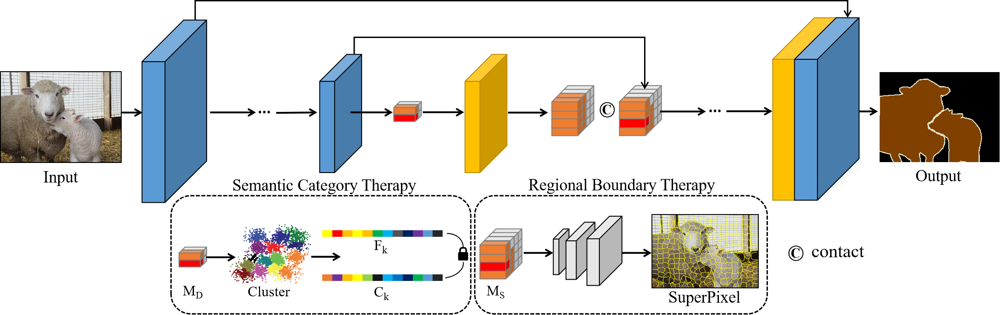

MODEL DOCTOR FOR DIAGNOSING AND TREATING SEGMENTATION ERROR
--------

Official implementation

[[paper link](https://arxiv.org/abs/2302.07116)]

## Abstract

Despite the remarkable progress in semantic segmentation tasks with the advancement of deep neural networks, existing U-shaped hierarchical typical segmentation networks still suffer from local misclassification of categories and inaccurate target boundaries. In an effort to alleviate this issue, we propose a Model Doctor for semantic segmentation problems. The Model Doctor is designed to diagnose the aforementioned problems in existing pre-trained models and treat them without introducing additional data, with the goal of refining the parameters to achieve better performance. Extensive experiments on several benchmark datasets demonstrate the effectiveness of our method.

## Framework



A synopsis of our proposed methodology, which is comprised of two facets: the semantic category treatment applied to the deep features $M_{D}$, and the regional boundary treatment applied to the shallow features $M_{S}$.
## Usage

### Installation
Our experimental environment is `python 3.8 & pytorch 1.11.0+cu113`. We strongly recommend you use `pytorch >= 1.11.0` for its less GPU memory consumption. 
```python
  argparse
  albumentations == 1.3.0
  numpy
```

### Dataset
[VOC2012] is used to validate our method ([百度网盘]( https://pan.baidu.com/s/1vkk3lMheUm6IjTXznlg7Ng?pwd=44mk). The directory structure is as follows: 
```
VOCdevkit/
  ├── VOC2012
    ├── ImageSets/
    ├── JPEGImages/
    └── SegnebtatuibsCkassAug/
```

```

### Training

In default, we divide the queries into three groups, with the proportion of 65%, 25%, and 15%, corresponding to relative scales of (0, 0.2], (0.2, 0.4], and (0.4, 1], respectively. `--q_splits` is to set the proportion of each group. `--matcher` has two options, `ori`(original HungarianMatcher) and `team`(TeamHungarianMatcher). If you want to change the responsible scale range of each group, you can modify matcher.py for Team-DAB-DETR and Team-DN-DETR or the config file for Team-DINO.

```bash
 CUDA_VISIBLE_DEVICES="0" torchrun \
   --nproc_per_node=1 \
   --master_port='29507' \
     finetune_seg.py \
   --use_ddp \
   --sync_bn \
   --num_classes 21 \
   --batch_size 8 \
   
 CUDA_VISIBLE_DEVICES="0" torchrun \
   --nproc_per_node=1 \
   --master_port='29507' \
     train_seg.py \
   --use_ddp \
   --sync_bn \
   --num_classes 21 \
   --batch_size 8 \  
# --------------------------------------------

```

## How to integrate query teamwork into your model

The query teamwork contains three parts: scale-wise grouping, position constraint, and preference extraction.

For details, you can refer to our code. Based on the source code of DAB-DETR / DN-DETR / DINO, every change in our code is clearly marked with "# qt ...". The changes involve main.py, [DABDETR.py,] *transformer.py, matcher.py and engine.py.

## LICENSE
SegDoctor is released under the Apache 2.0 license. Please see the [LICENSE](LICENSE) file for more information.

Copyright (c) VIPA. All rights reserved.

Licensed under the Apache License, Version 2.0 (the "License"); you may not use these files except in compliance with the License. You may obtain a copy of the License at http://www.apache.org/licenses/LICENSE-2.0

Unless required by applicable law or agreed to in writing, software distributed under the License is distributed on an "AS IS" BASIS, WITHOUT WARRANTIES OR CONDITIONS OF ANY KIND, either express or implied. See the License for the specific language governing permissions and limitations under the License.

## BibTex
If you find Team DETR useful in your research, please consider citing:   
```bibtex
coming soon ...
```
